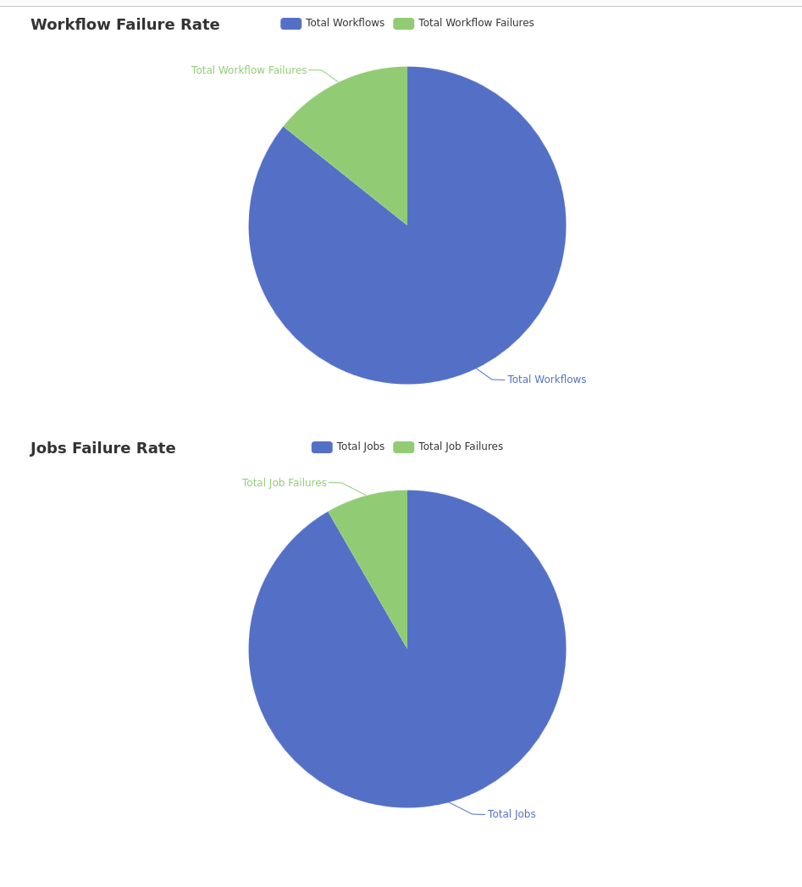

# gh-metrics
Get metrics from github workflow runs

## Using

### Setup relevant parameters

`organization` and `repository` parameters can be configured as in [config.yaml](config.yaml) or
through the `GH_ORGANIZATION` and `GH_REPOSITORY` environment variables.  

### Environment variables

| Environment Variable | Default | Required | Example    | Description |
| -------------------- | ------- | -------- | ---------- | ----------- |
| GH_ORGANIZATION      | ''      | no     | rmiguelac  | The owner/org of the repo to be analyzed |
| GH_REPOSITORY        | ''      | no     | gh-metrics | The repo to be analyzed |
| GH_API_TOKEN         | ''      | true   | GH-PAT     | The Personal Access Token |

To have them, simply do:

`export VAR=value`

### Run

Simply run it with `go run main.go` or build it with `go build .` then run it `./gh-metrics`

### Output

A `metrics.html` shouuld've been created in the same folder where the code is.

## Example Output

  

## TODO

[.] Support Query Workflows between dates  
[] Add proper logging  
[] Add metrics to influxdb  
[] Add CLI support  
