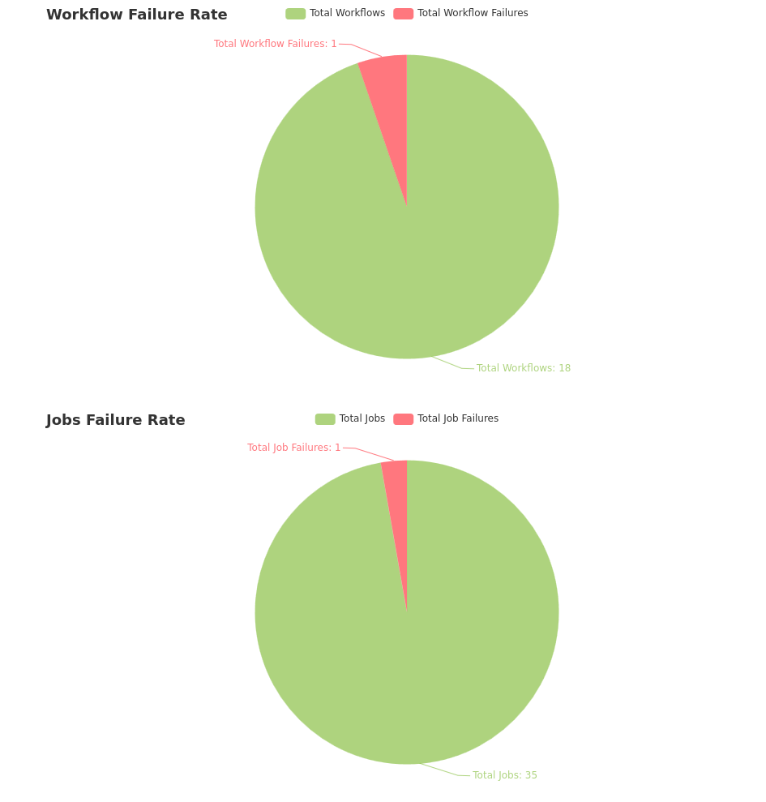

# gh-metrics
Get metrics from github workflow runs

## Using

### Setup relevant environment variables

| Environment Variable | Default | Required | Example    |
| -------------------- | ------- | -------- | ---------- |
| GH_ORGANIZATION      | ''      | true     | rmiguelac  |
| GH_REPOSITORY        | ''      | true     | gh-metrics |
| GH_API_TOKEN         | ''      | true     | GH-PAT     | 

## Example Output

  

## TODO

[] Support Pagination  
[] Support Query Workflows betwwen dates  
[] Show values in pie charts  